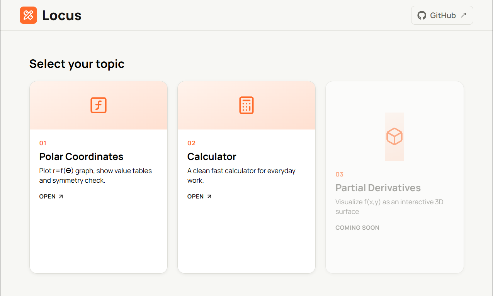

# Locus 
A visual math tools website built for engineering students.



## Live Demo
[View Live](https://locus-wine.vercel.app/)

## Built with 
<table>
    <tr>
        <td align="center">
        <br><sub>React + Vite</sub>
        </td>
        <td align="center">
        <br><sub>mathjs</sub>
        </td>
    </tr>
</table>


## Features
### Polar Coordinates
- Plot any r = f(θ) curve instantly
- r-θ table at all major angles (0°, 30°, 45°...360°)
- Auto-scaled polar grid with angle lines
- Symmetry check about axis and pole
- Quick-start "try" presets to plot common curves in one click

### Calculator
- Basic arithmetic with parentheses and percentage support
- Clear (AC) and single-character delete (DEL)

## Planned Features
### Partial Derivatives
- Partial derivative visualizer (3D surface plotter)

### Polar Coordinates
- Calculate the total area of the given curve

# Run it locally
1. Clone the repo 
```bash
git clone https://github.com/Aashutosh-kc/math-app.git
```
2. Change directory 
```bash
cd math-app
```
3. Run it 
- Run these commands one by one. ( Make sure you have Node.js installed)
```bash 
npm install
npm run dev 
```
- Click on the given localhost link
``` bash
http://localhost:5173/
```
## Roadmap

- [x] Polar graph plotting
- [x] r-θ table generation
- [x] Symmetry detection
- [x] Basic calculator
- [ ] Polar area calculator
- [ ] Partial derivative visualizer
- [ ] Tangent plane calculator
- [ ] Multiple graph comparison
