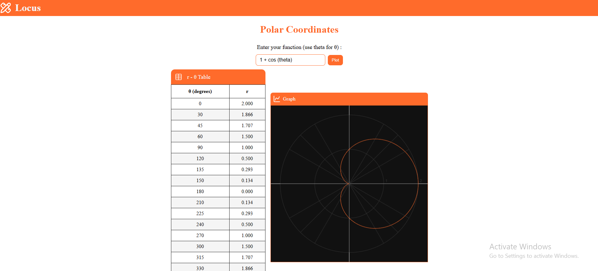

# Locus 
A visual math tools website built for engineering students.



## Live Demo
[View Live](https://locus-wine.vercel.app/)

## Built with 
<table>
    <tr>
        <td align="center">
        <br><sub>React + Vite</sub>
        </td>
        <td align="center">
        <br><sub>mathjs</sub>
        </td>
    </tr>
</table>


## Features
### Polar Coordinates
- Plot any r = f(θ) curve instantly
- r-θ table at all major angles (0°, 30°, 45°...360°)
- Auto-scaled polar grid with angle line

## Planned Features
- Partial derivative visualizer (3D surface plotter)

# How to run 
1. Clone the repo 
```bash
git clone https://github.com/Aashutosh-kc/math-app.git
```
2. Change directory 
```bash
cd math-app
```
3. Run it 
- Run this command 
```bash 
npm install
npm run dev 
```
